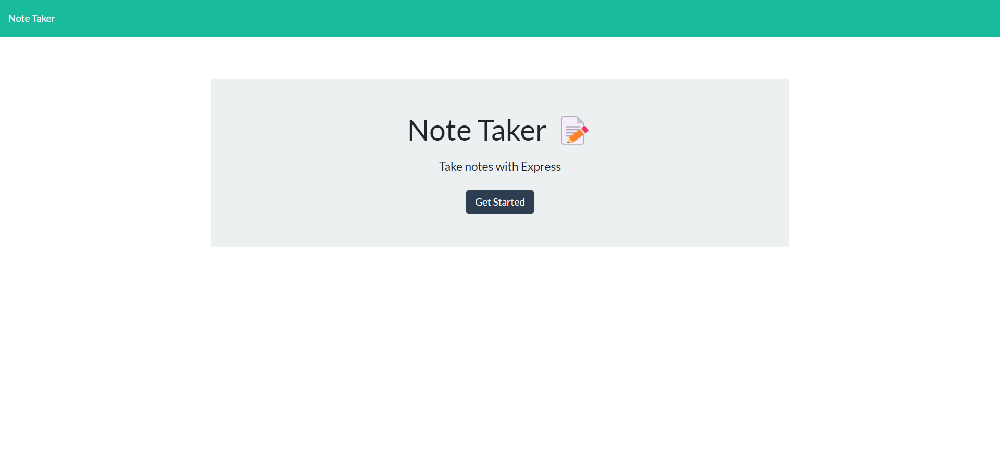
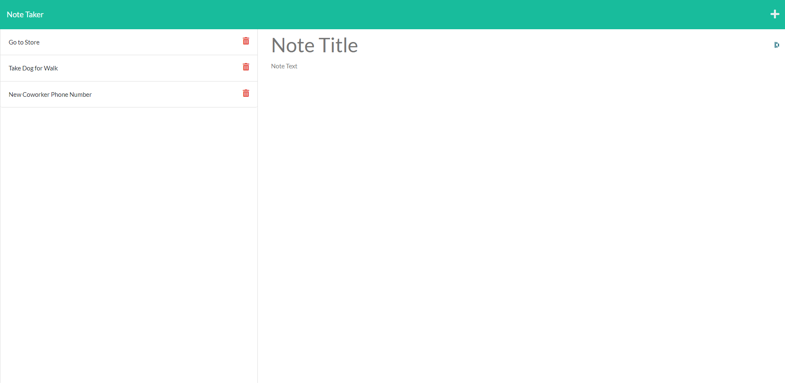

# express-note-taker

# team-profile-generator

## Description

This is a note taking application that allows the user to take, store, and delete notes.

The purpose of this project was to practice writing and utilizing an Express.js backend server.

This app uses:

- Node.js
- Express.js

## Table of Contents

- [Deployment](#deployment)
- [License](#license)
- [Questions](#questions)

## Deployment

Delpoyed at:
https://express-note-taker-7913.herokuapp.com/

Home Page:

Note Page:

## License

See the [LICENSE](LICENSE.md) file for license rights and limitations (MIT License).

## Questions

Feel free to reach me on [GitHub](https://github.com/struelensc).
